# Quoridor game

Quoridor game implemented using Keil µVision and a LandTiger board, for the course "Architetture dei sistemi di elaborazione" (Politecnico of Turin).

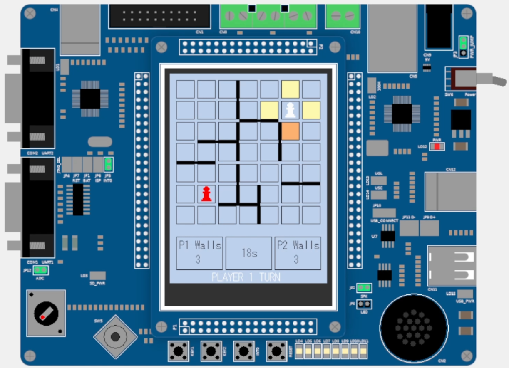
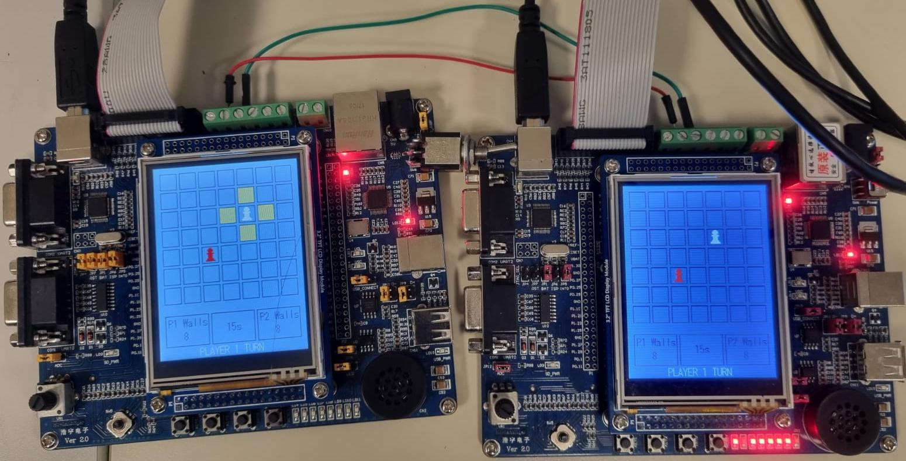

## Rules

Each player is equipped with a token and eight barriers. The game board is a 7x7 wooden square,
with the peculiar feature that the lines dividing and forming the squares are grooved, allowing
walls to be inserted.

Each player starts from the center of their perimeter line (the 4th square), and the goal is to get
their token to the opposite perimeter line. The player who achieves this objective first wins.

On their turn, a player has two choices:
1. They can choose to move their token horizontally or vertically;
2. He/she can choose to place a wall. The wall cannot be jumped over but must be navigated around.

At every step of the game, there are always two players: the moving player (the one who is making
the choice), and the opponent. Their roles alternate at every step.

• If two tokens (the moving player and the opponent) are facing each other, the moving player
can jump over the opponent and position themselves behind them if there is no barrier behind
the opponent.

• It is not allowed to "trap" a player with the help of walls; you must always leave them a way
to reach the goal.

• A move must be chosen within 20 seconds, or else it loses the turn.

• If players are facing each other, you can jump an extra square as in the figure below.

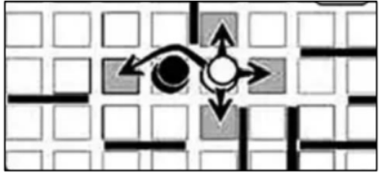

• In case players are facing each other, and there is a wall behind the opponent, you can move to the square next to the opponent, as Figures below show.

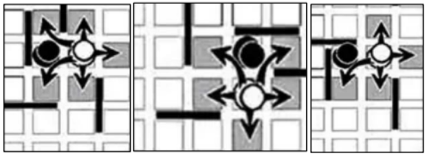

## Game modes

There are 3 game modes you can choose, sharting from the main Menu. Start by selecting the game mode: single board, and two boards.
This menu is shown after INT0 is pressed (in multiplayer mode, who presses INT0 becomes the player 1).

There is a handshake between the “Two Boards“ in multiplayer mode.
In case the handshake fails, it means that you cannot play in multiplayer mode (i.e., there is no other LandTiger board attached) and the system shows an error message.
Use the JOYSTICK to move between the options and the JOY SEL to confirm the choice.

After the number of boards is selected, the you can choose the opposite player (Human or NPC).

### Single player mode
This is the classic mode, 2 users play on a single board by alternating its usage.

### Multiplayer Mode

A multiplayer mode (1 vs. 1) of Quoridor game has been implemented, by connecting two LandTiger Board through the CAN bus, as shown in the figure below.

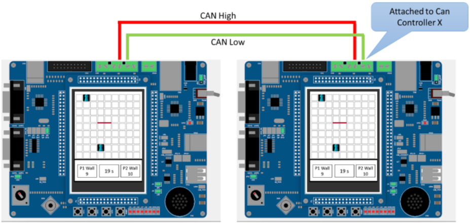

#### Specification for coordinates
The system in charge of handling the coordinates information is crucial.
It must be commonly defined among all the Extra Point implementations to play in multiplayer mode effectively.
The following figure shows a coordinate system (using integer coordinates on the LCD).

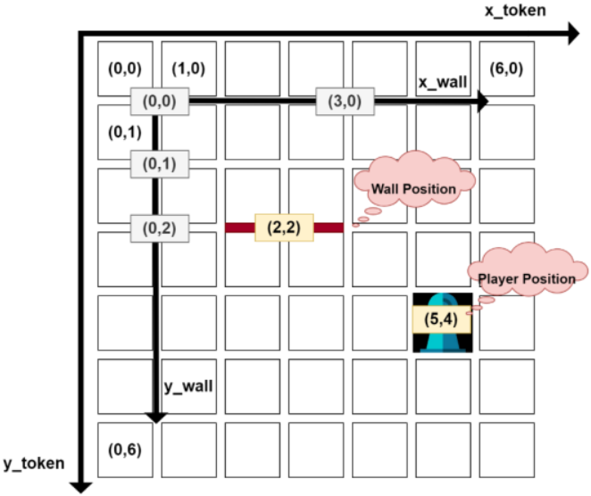

The y_token and x_token are the axes used to represent the player's center. For example, Player in (5,4) represents the center of the square where the player is placed.

Where the y_wall and x_wall are the axes used to represent the center of the wall. For example, wall in (2,2) represents the center of the wall in which the wall is
placed.

Please note that the x_wall and y_wall axis are coordinate within the Player move coordinate system.

Data is exchanged between boards through the CAN bus (in the data field of the CAN Frame) with the following structure:

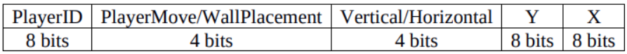

In simple words (x and y in the aforementioned data structure):

• Wall position (WallPlacement) must represent the wall’s center in the wooden square on the LCD.

• Player position(PlayerMove=0) must represent the player’s center in a given square on the LCD.

### Non-Player Character (NPC)

You can play versus the board itself (NPC) as your opponent.
Your opponent plays a turn right after you place a wall or move your character.

The opponent uses a Depth-First-Search (DFS) algorithm to find the best path to follow, and tries to block your way by placing the wall in the position that slows you the most.

## Specifics

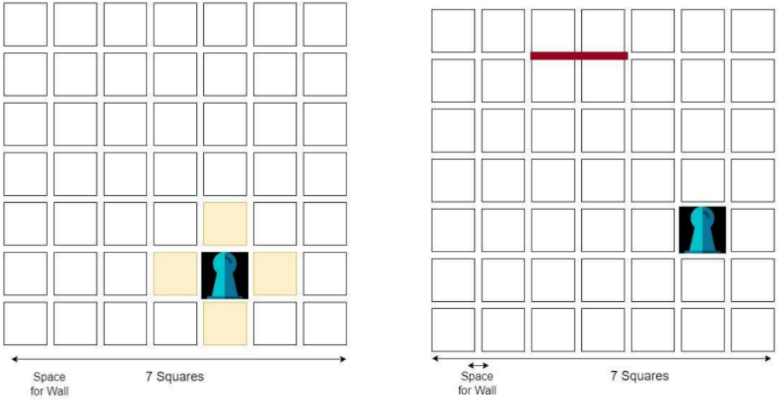

Using the DISPLAY library, draw your game board as a 7x7 wooden square.
Draw the two tokens using two colours: white (PLAYER1) and red (PLAYER2).
Remember that each player has 8 available barriers (or walls).
The tokens must move using squares (vertically or horizontally).
The barriers must be placed between squares.

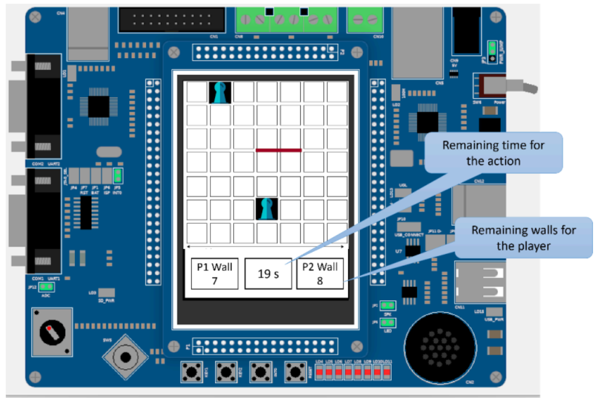

When the system starts, to start a match, you must press INT0 (otherwise you remain in wait mode).
From now on, you are in the match/game mode.

Each player has 20 seconds to do the move. If time expires, the player loses the turn.

At this point, remember that the player has two choices:

1. He/she moves of 1 step vertically or horizontally. To do this, use the JOYSTICK.
  1. JOY UP
  2. JOY DOWN
  3. JOY LEFT
  4. JOY RIGHT
  5. JOY SELECT: confirm the choice. The game continues with PLAYER2.
  6. The 4 squares surrounding the player (as in Figure 1) are highlighted, i.e., the player’s possible moves.

2. He/she can insert a wall to block the opposite player. To enter in this mode, the player must
press KEY1. A wall will appear in the centre (the map itself is 7x7 and the wall is placed
between two squares).
  1. After pressing KEY1, it appears in the centre of the 7x7 square.
  2. Use the JOYSTICK to determine the position of the wall. Once that the position is found, press JOY SELECT to confirm the position.
  3. Be careful about the wall position. A wall is sized with two squares plus a space between them.
  4. Each player has only 8 walls to position. If it ends them, a warning message will appear on the screen: “No walls available, move the token”.
  5. Pressing KEY2 rotates the wall in the current position of 90 degree.
  6. Pressing KEY1 again before confirming the position of the wall disable the wall insertion mode and return to player move mode.

### Example

An example on how the wall functionality is implemented is shown in the following figures:

1. After pressing KEY1 a wall appears in a central place on the map. If you want, you can customize its colour to show that the position is not yet finalized.

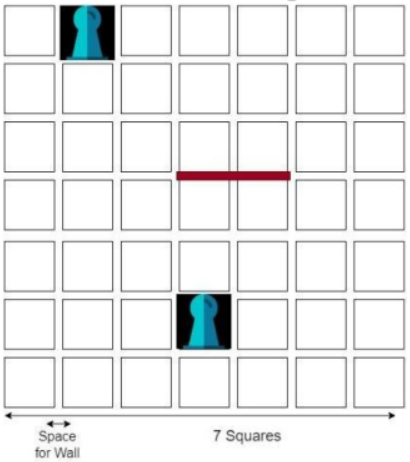

2. By going up with the Joystick the wall is moved up by one square

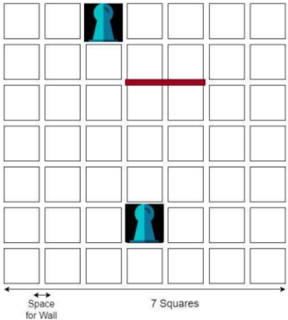

3. By clicking KEY2 the wall is rotated by 90 degrees

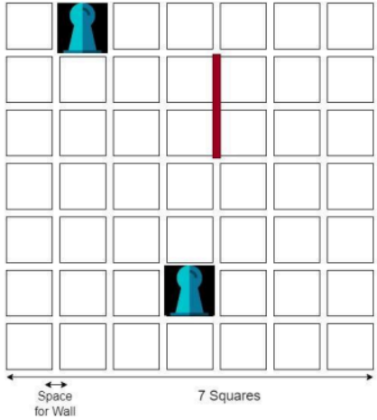

4. By clicking JOY SELECT you finalise the position of the wall, and your turn is finished

5. The game ends when one of the players reaches the opposite side of the 7x7 square

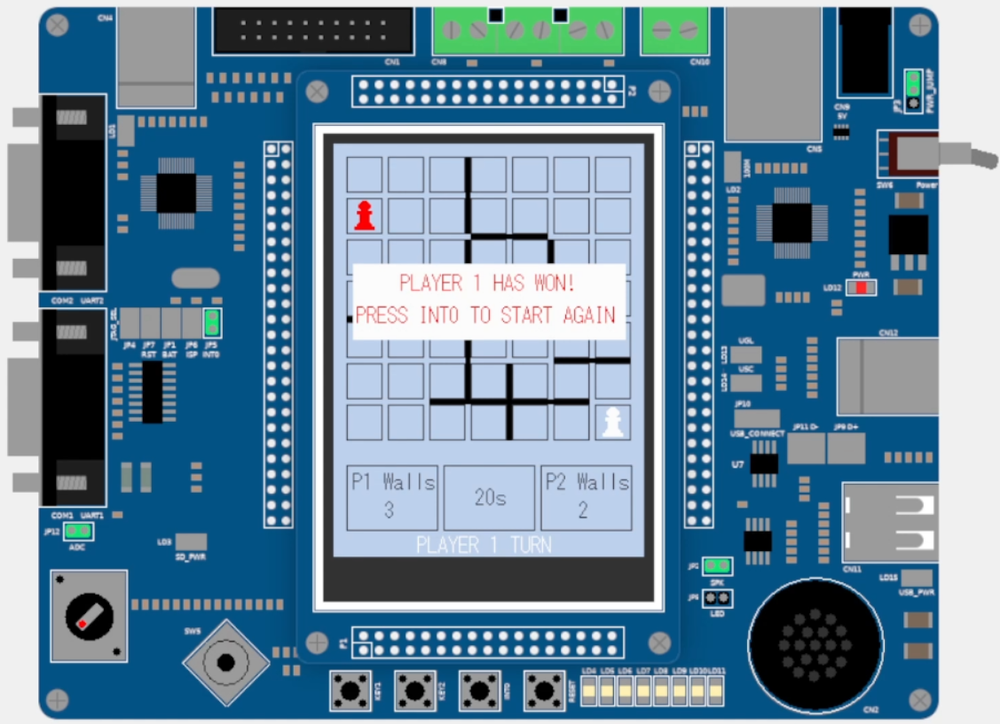

## Implementation details

The real grid used under the hood is a matrix of size 13x13 that can be used to place both the walls and the players, as shown in the image below.

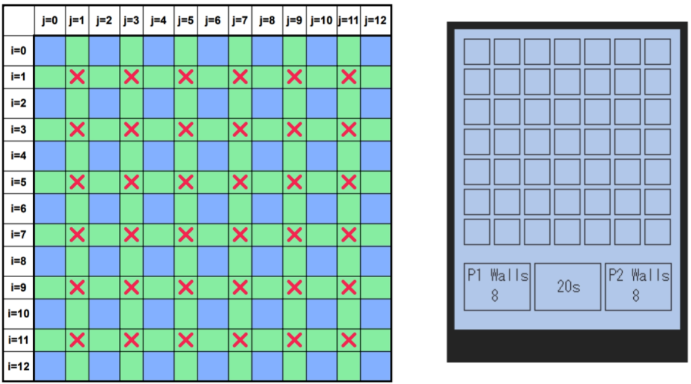

#### i even, j even = player position

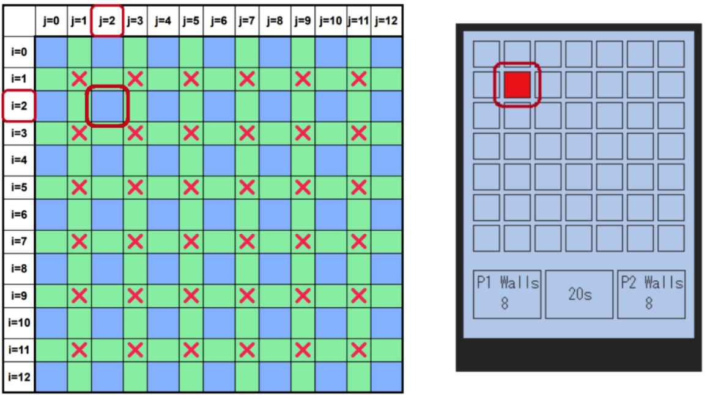

#### i even, j odd = vertical wall position

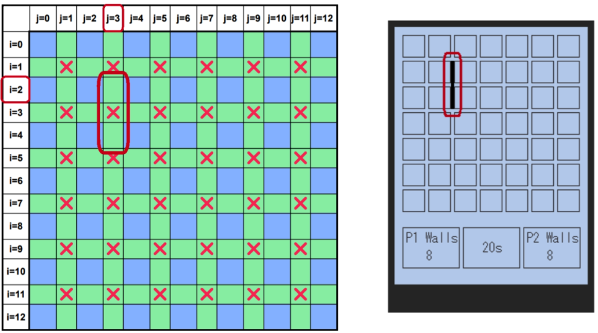

#### i odd, j even = horizontal wall position

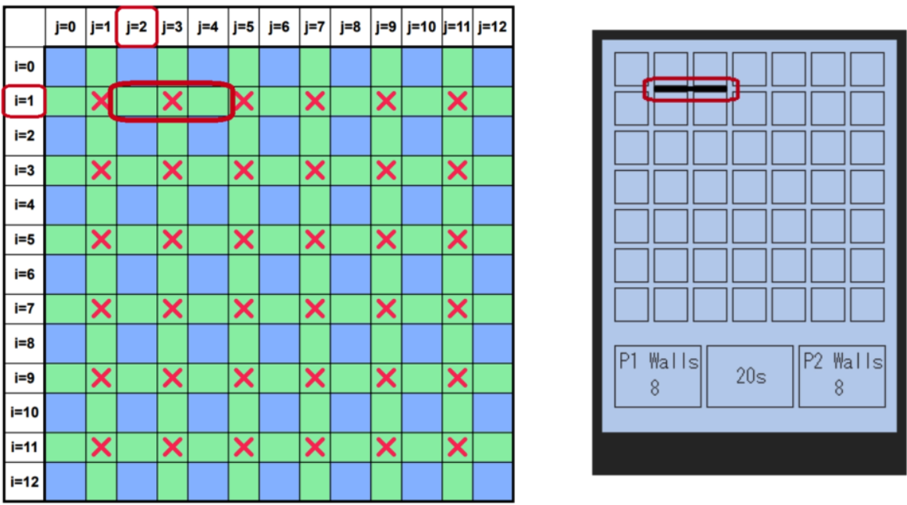

#### i odd, j odd = invalid position, not used

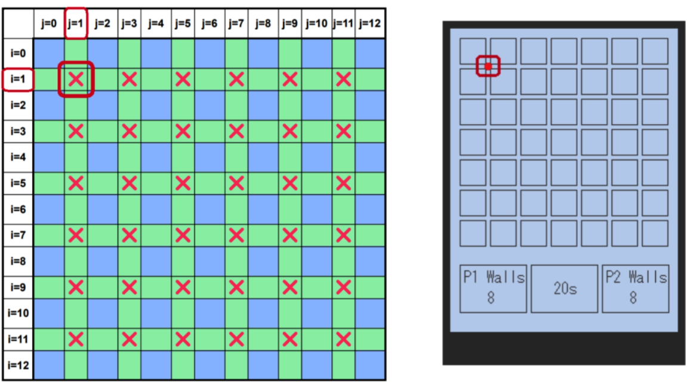

